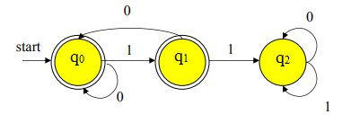
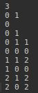
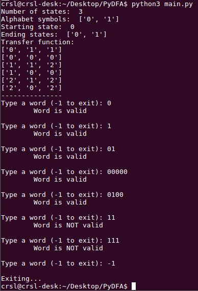

# PyDFA
A basic Python 3 project that scans a given word and returns if its valid or not based on a DFA defined by a text file

More specific, a `dfa.txt` file is specifically given as input, which contains the necessary information to create an object that corresponds to a DFA.

### Example
In this example, the DFA diagram could be:

which means the `dfa.txt` here should look like this:

where:
* 1st line indicates the **number of states**,
* 2nd line indicates the **alphabet symbols**,
* 3rd line indicates the **starting state**,
* 4th line indicates the **ending state(s)**,
* and the rest of the line indicate the **transfer function** (where first character is the current state, second character is the current symbol being scanned and third symbol is the next state accessible)

so the output would be:

### How to Run
`python3 main.py`

### Notes
* At this point, the information inside the `dfa.txt` file is to always be considered _**correct**_ 
* The text file input examples given are
  * the example as seen above (`dfa.txt`)
  * an automaton that accepts words with an even number of `0`s and `1`s (`dfa1.txt`)
  * an automaton that accepts words that end with `00` (`dfa2.txt`)
  * an automaton that accepts word that either begin or end with `01` (`dfa3.txt`)
* Written in [_Sublime Text_](https://www.sublimetext.com/) with the [_Anaconda_](http://damnwidget.github.io/anaconda/) package
* Tested with _**Python 3.5.2**_ on _**Lubuntu 16.04.6**_.
